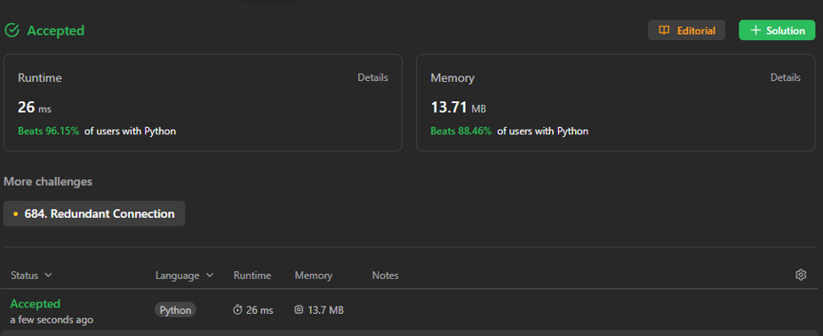
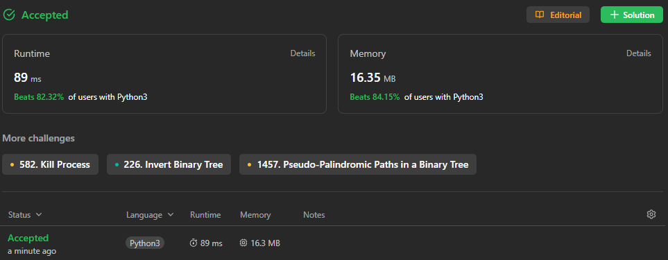
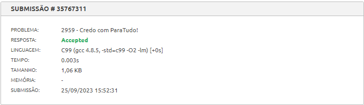

## Exercicios Juiz Online

Temas:
 - Grafos1

## Alunos
|Matrícula | Aluno |
| -- | -- |
| 19/0142421  |  Artur Vinicius Dias Nunes |

## Sobre 
Exercicios resolvidos de juizes onlines Beecrowd e LeetCode, sobre o tema grafos 1.

[Conexão Redundante 2 - 685](https://leetcode.com/problems/redundant-connection-ii/)  
[Posicao Sapo apos T segundos - 1377](https://leetcode.com/problems/frog-position-after-t-seconds/)  
[Credo para Tudo! - 2959](https://www.beecrowd.com.br/judge/pt/problems/view/2959) 

## Screenshots

## Instalação 
**Linguagem**: C e Python 

## Uso 
Para executar os programas, basta baixar os códigos e submetê-los em um compilador online ou em um editor de código-fonte.

## Vídeos

https://github.com/projeto-de-algoritmos/Grafos1_ExerciciosJuiz/assets/58870950/63e94f3b-2193-4b19-b9fb-5bd0ed5e8409

